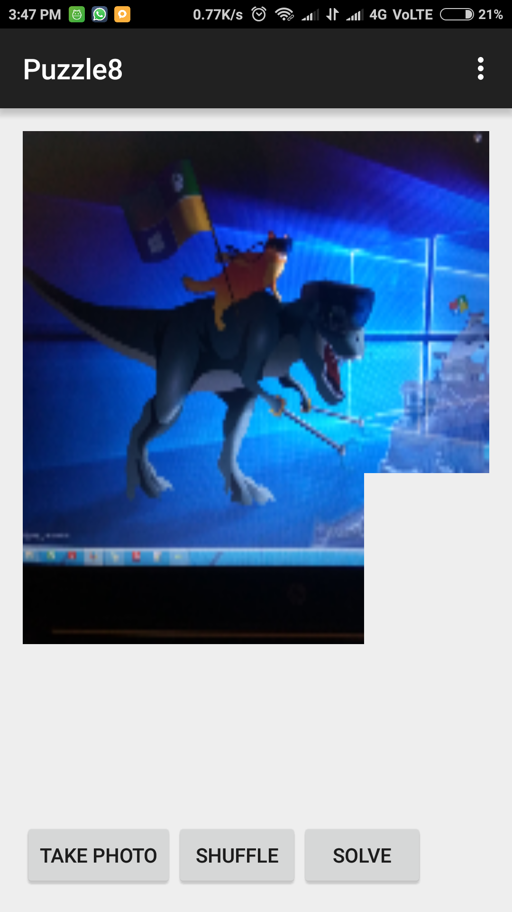
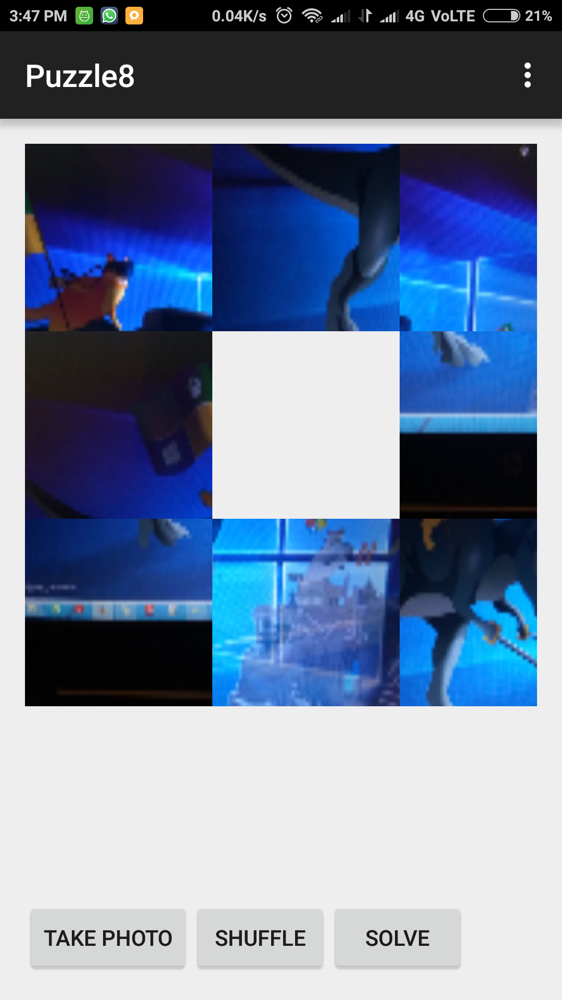

# PuzzleGame
It is a game which allow user to take photo and shuffle it and solve it.

|  |   |
|-------------------------------------------|--------------------------------------------|

This app was made during google workshop 'Applied CS With Android'.

What does it do?

You can take a image from your app and then click the shuffle button.
Now try to solve the puzzle, if you get stuck somewhere then you can click on the solve button.
DataStructure used in this game is trieNode. 
